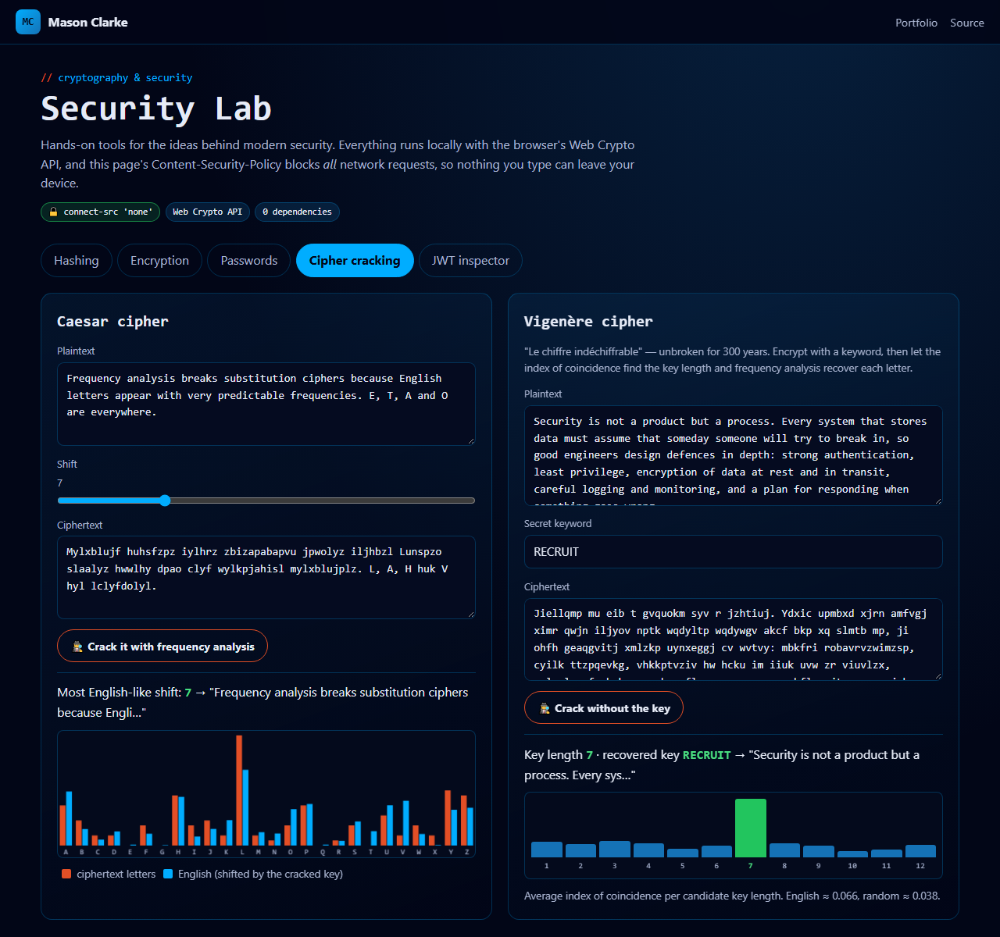

# Security Lab

[](https://github.com/Masons-coding/security-lab/actions/workflows/ci.yml)

**Live demo → https://masons-coding.github.io/security-lab/**

Hands-on tools for the core ideas of cryptography and application security, built on the browser's **Web Crypto API** with zero dependencies. The page ships a Content-Security-Policy with `connect-src 'none'`, so it can't make network requests and nothing typed into it can leave the device.



## Tools

| Tool | What it demonstrates |
| --- | --- |
| **Hashing** | SHA-1/256/384/512 digests, plus an **avalanche-effect** visualiser showing ~50% of bits flip when one character changes |
| **Encryption** | Password-based **AES-256-GCM** with a **PBKDF2-SHA256** key (600k iterations, OWASP 2023), random salt and IV, and a "tamper 1 bit" button showing authenticated encryption reject modified data |
| **Passwords** | Entropy estimation with penalties for common passwords, dictionary words, l33t-speak, keyboard walks, sequences and dates. Passphrases are modelled as Diceware words, and crack times are given for four attacker models |
| **Cipher cracking** | Caesar broken by **chi-squared frequency analysis**. Vigenère broken by finding the key length with the **index of coincidence**, then solving each column |
| **JWT inspector** | Decode tokens, audit claims (`alg: none`, expiry, lifetime, secrets in the payload), verify HS256 signatures, and see a forged `role=admin` token fail |

## Tested against known answers

- SHA outputs match the official **FIPS 180** test vectors
- AES-GCM round-trips, rejects wrong passwords, rejects a single flipped bit, and never produces the same ciphertext twice
- The Vigenère cracker recovers the keys `KEY`, `MASON` and `SECURITY` from ciphertext alone
- HS256 tokens verify with the right secret and fail when the secret or payload changes
- The password model ranks known-bad passwords as weak and random ones as very strong, and scores a 4-word passphrase at exactly 4 × log₂(7776) bits

```bash
npm test     # 23 tests, Node's built-in runner (Node 20+ ships Web Crypto)
npx serve .
```

## Security concepts

Confidentiality, integrity and authenticity · one-way hash functions and collision resistance (why SHA-1 is retired) · key derivation, salting and work factors · AEAD and nonce reuse · entropy vs. real-world guessability · stateless auth with JWTs and their pitfalls · Content-Security-Policy as defence in depth

---

Built by [Mason Clarke](https://masons-resume-website.netlify.app) · [LinkedIn](https://www.linkedin.com/in/mason-clarke/)
